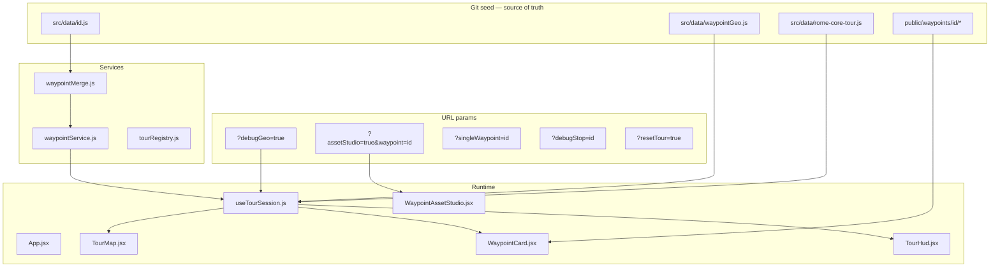

# ChronoWalk — Waypoint Playbook

**Repeatable workflow for adding tour stops with matched modern ↔ ancient slider assets.**  
Use this doc yourself, hand it to Cursor/Claude agents, or paste the [Gemini handoff block](#gemini-handoff-where-we-are-now) into a Gemini session to continue production.

**Related docs**
- **[ASSET_STUDIO_LINKS.md](./ASSET_STUDIO_LINKS.md)** — bookmarkable prompt links per waypoint
- [WAYPOINT_ASSET_PIPELINE.md](./WAYPOINT_ASSET_PIPELINE.md) — framing rules, asset quality bar, failure modes
- [CHRONOWALK_BUILD_STATE.md](./CHRONOWALK_BUILD_STATE.md) — overall build state, deploy, env vars

---

## Where we are now (June 2026)

| Stop | `id` | Tour order | Assets | Notes |
|------|------|------------|--------|-------|
| Colosseum | `colosseum` | 1 | ✅ Production | Reference implementation; `moderncolosseum.mp4` naming |
| Pantheon | `pantheon` | 2 | ✅ Production | Re-scouted mid-piazza POV; `npm run process-pantheon` |
| Piazza Navona | `piazza-navona` | 3 | 🟡 Scaffold | Code + placeholder media; needs real AI assets |

**Asset Studio (AI prompts):** see **[ASSET_STUDIO_LINKS.md](./ASSET_STUDIO_LINKS.md)** — one link per stop, e.g.  
http://localhost:5173/?assetStudio=true&waypoint=piazza-navona

**Tour:** `rome-core` — `Colosseum → Pantheon → Piazza Navona`  
**Branch / PR:** `cursor/chronowalk-setup-a224` · [PR #4](https://github.com/isienrione/pirisibits/pull/4)

Multi-stop tour is fully wired: map markers, walking routes (Mapbox), transit audio, progress persistence, HUD “Walk to next stop” (after card dismiss).

---

## Video processing rules (read before every new waypoint)

### Default: name your files to match the era

Drop into `public/waypoints/<id>/incoming/`:

| Incoming filename | Becomes | Must show |
|-------------------|---------|-----------|
| `modern-source.mp4` | `modern.mp4` | **Today** (modern Rome) |
| `ancient-source.mp4` | `ancient-reconstruction.mp4` | **Ancient** era reconstruction |

Then run:

```bash
npm run process-waypoint -- <id>
```

You should see: `Mapping: literal (ancient → ancient-reconstruction.mp4, modern → modern.mp4)`

### Exception: Pantheon only

Runway mislabeled Pantheon downloads. **Only Pantheon** uses swap mapping — built into `npm run process-pantheon` (`SWAP_RUNWAY=1`).  
**Do not** use `process-pantheon` for other stops.

### Never copy media from another stop

Scaffolding may copy placeholder files so verify passes. **The slider will show the wrong landmark** until you replace:

1. `modern-exterior.jpg` — Street View export (Asset Studio → Open Street View)
2. `incoming/modern-source.mp4` + `incoming/ancient-source.mp4` — your Runway clips
3. Re-run `npm run process-waypoint -- <id>`

`npm run verify-waypoint -- <id>` warns if files are byte-identical to colosseum/ or pantheon/.

### Supabase copy-paste trap

If a Supabase row for `<id>` still has `/waypoints/pantheon/...` URLs, the app now ignores those and uses local seed paths — but the **files on disk** must still be Navona-specific.

---

## Architecture (what talks to what)



**Two coordinate systems (never merge them)**

| Field | Used for |
|-------|----------|
| `lat`, `lng` on waypoint | Map pin, geofence center |
| `viewpoint.{lat,lng,heading,pitch}` | Slider camera POV — where visitor stands |

Geofence fires at landmark center. Slider plays pre-baked assets shot from viewpoint.

---

## Code touchpoints (every new waypoint)

| Step | File(s) | Action |
|------|---------|--------|
| 0 | `public/waypoints/<id>/` | Create asset folder + `incoming/` |
| 1 | `src/data/<id>.js` | Seed: coords, copy, media URLs, `framingProfile` |
| 2 | `src/services/waypointMerge.js` | Register in `getLocalWaypoint()` |
| 3 | `src/data/waypointGeo.js` | Map zone, geofence, debug GPS, `mapZoom` |
| 4 | `src/data/rome-core-tour.js` | Insert `id` in `stopIds` (order = walk order) |
| 5 | `package.json` | Optional: `process-<id>`, `verify-<id>` aliases |
| 6 | Tests | See [Test checklist](#test-checklist) |

**No `App.jsx` changes needed** — tour loads all `stopIds` automatically via `useTourSession`.

---

## Agent workflow (phases 0–7)

### Phase 0 — Scaffold (agent / Cursor)

```bash
cd chronowalk
ID=piazza-navona   # example

mkdir -p public/waypoints/$ID/incoming
cp src/data/pantheon.js src/data/$ID.js   # edit thoroughly
# Register in waypointMerge.js, waypointGeo.js, rome-core-tour.js
npm test
```

**Create your Asset Studio link** (prompts auto-generate from the seed file):

```
http://localhost:5173/?assetStudio=true&waypoint=<id>
```

Add the link to [ASSET_STUDIO_LINKS.md](./ASSET_STUDIO_LINKS.md) and `public/waypoints/<id>/README.md`.

**`framingProfile`**
- `large_approach` — Colosseum-style (offset 40–120 m)
- `compact_piazza` — Pantheon / Navona-style (offset 18–45 m)

### Phase 1 — Scout viewpoint (human + Street View)

1. Open Asset Studio: http://localhost:5173/?assetStudio=true&waypoint=<id>  
   (all links: [ASSET_STUDIO_LINKS.md](./ASSET_STUDIO_LINKS.md))
2. Walk Street View **along the tourist approach** — not the Maps pin / plaza center
3. Target pitch **14–22°**, monument **60–75% of frame height**
4. Record `viewpoint` + `immersive_orientation_hint` + Street View URL in seed comments
5. Confirm `assessModernFraming()` passes (shown in Asset Studio)

**Gemini prompt (Phase 1)**

```
I'm adding waypoint "<id>" to ChronoWalk. Landmark: <name>, Rome.
Using Google Street View, find a ground-level tourist stand-here spot facing the hero facade.
Constraints: viewpoint 18–45m from landmark center (compact piazza), pitch 16–18°,
16:9 framing, facade fills 60–75% of frame. Return lat, lng, heading, pitch,
and a one-sentence immersive_orientation_hint.
```

### Phase 2 — Modern layer

| File | Role |
|------|------|
| `modern-exterior.jpg` | Still fallback (export from Street View at viewpoint) |
| `modern.mp4` | ~5 s slider video, locked camera |
| `modern-poster.jpg` | Hero frame @ `slider_poster_at_sec` (default 3 s) |

**Gemini / Runway prompt:** copy from Asset Studio → “Modern animated video”.

### Phase 3 — Ancient layer (same POV)

| File | Role |
|------|------|
| `ancient-reconstruction.mp4` | Era swap animation, same framing |
| `ancient-reconstruction.jpg` | Frame 0 fallback |
| `ancient-poster.jpg` | Pad square sources to 16:9 |

**Gemini / Midjourney prompt:** Asset Studio → “Ancient still” (use modern photo as reference).

**Runway filename trap (Pantheon only):** Pantheon uses `SWAP_RUNWAY=1` because Runway mislabeled clips. **All other waypoints:** `ancient-source` → ancient, `modern-source` → modern (literal).

### Phase 4 — Audio

| Field | File (placeholder OK for MVP) |
|-------|-------------------------------|
| `arrival_immersive_url` | **Required** — main narration MP3 |
| `transit_narrative_url` | Plays while walking to this stop |
| `ambient_url` | Tour / stop ambient |
| `arrival_alert_url` | Short WAV on geofence entry |

Copy `Audio_sample.mp3` + `geocache-arrival-alert.wav` from another stop until real audio is recorded.

### Phase 5 — Process & verify

```bash
npm run process-waypoint -- <id>
npm run verify-waypoint -- <id>
```

Confirm output says **literal mapping** (not swap). Fix any `⚠ identical to pantheon` warnings before testing.

```bash
npm test && npm run build
```

### Phase 6 — Device test URLs

| Goal | URL |
|------|-----|
| Full tour | `?resetTour=true&debugGeo=true` |
| Jump to stop | `?debugGeo=true&debugStop=<id>` |
| Single-stop only | `?singleWaypoint=<id>&debugGeo=true` |
| Asset Studio | `?assetStudio=true&waypoint=<id>` |
| Tune poster frame live | add `&posterAt=3&loopMs=10000` |

**Important:** `?waypoint=` is **Asset Studio only**. It does **not** set single-stop mode.

### Phase 7 — Supabase (optional)

Table `waypoints` — columns match seed schema. Local git seed wins for `viewpoint`, `lat`, `lng`, `framingProfile`. URLs pointing at **another** waypoint's folder are ignored (`waypointMerge.js`).

---

## File layout

```
public/waypoints/<id>/
  modern-exterior.jpg
  modern.mp4
  modern-poster.jpg
  ancient-reconstruction.mp4
  ancient-reconstruction.jpg
  ancient-poster.jpg
  geocache-arrival-alert.wav
  Audio_sample.mp3              # placeholder
  depth-map.png                 # optional (Colosseum only today)
  incoming/                     # raw Runway exports (*.mp4 gitignored)
    README.md
  README.md
```

---

## Seed file schema (`src/data/<id>.js`)

```javascript
export const SITE = { lat, lng }                    // landmark center
export const SITE_VIEWPOINT = { lat, lng, heading, pitch }
export const SITE_WAYPOINT = {
  id, title, framingProfile?,                        // 'compact_piazza' | 'large_approach'
  arrival_headline, arrival_subtitle,
  immersive_orientation_hint,
  lat, lng, viewpoint,
  modern_image_url, modern_video_url, modern_poster_url,
  ancient_image_url, ancient_video_url, ancient_poster_url,
  slider_poster_at_sec: 3,
  slider_post_animation_loop_ms: 10000,
  slider_freeze_at_sec: 3,
  ambient_url, transit_narrative_url,
  arrival_immersive_url,                            // required at runtime
  arrival_alert_url,
  depth_map_url?,                                   // optional
}
```

---

## Tour flow (visitor experience)

1. **Start screen** — tour title + stop list → “Start Immersive Tour”
2. **Transit** — ambient audio, map shows all stops + route to current target
3. **Arrival** — geofence ≤ 30 m → chime → waypoint card slides up
4. **Explore** — immersive slider, audio, ghost alignment
5. **Dismiss card** — swipe down / minimize handle
6. **Continue** — TourHud shows “Walk to {next}” → transit narration → next geofence

Progress saved in `localStorage` key `chronowalk:tour-progress:rome-core`.

---

## Test checklist

```bash
cd chronowalk && npm test
```

| Test file | Add for new waypoint |
|-----------|---------------------|
| `src/services/__tests__/waypointMerge.test.js` | `getLocalWaypoint('<id>')` smoke |
| `src/utils/__tests__/modernFramingGuide.test.js` | `assessModernFraming()` passes |
| `src/services/__tests__/tourRegistry.test.js` | Update `stopIds` / leg count if asserting |
| `src/config/__tests__/env.test.js` | Optional URL param example |

---

## Scripts reference

| Command | Purpose |
|---------|---------|
| `npm run dev` | Local dev server |
| `npm run process-waypoint -- <id>` | ffmpeg: incoming → deliverables |
| `npm run verify-waypoint -- <id>` | Check required files exist |
| `npm run process-pantheon` | Alias for `pantheon` |
| `npm run verify-pantheon` | Alias for `pantheon` |
| `npm test` | Vitest |
| `npm run build` | Production build |

---

## Piazza Navona — worked example (scaffolded)

| Item | Value |
|------|-------|
| `id` | `piazza-navona` |
| Ancient site | Stadium of Domitian (Circus Agonalis) |
| Landmark center | `41.89918, 12.47306` |
| Viewpoint | `41.89878, 12.47302` — south edge, facing north |
| Heading / pitch | `2°` / `18°` |
| `framingProfile` | `compact_piazza` |
| Asset Studio | `?assetStudio=true&waypoint=piazza-navona` |
| Seed | `src/data/piazza-navona.js` |

**Next production steps for Navona**
1. Export real `modern-exterior.jpg` from Street View at viewpoint
2. Run Asset Studio prompts → Runway / Midjourney
3. `npm run process-waypoint -- piazza-navona`
4. Replace placeholder audio with recorded narration
5. Verify on phone: `?debugGeo=true&debugStop=piazza-navona`

---

## Troubleshooting (common errors)

**You don't need to re-scaffold Piazza Navona in code** — it's already on branch `cursor/chronowalk-setup-a224`. Pull first:

```bash
git pull origin cursor/chronowalk-setup-a224
cd chronowalk && npm install
```

### `Usage: npm run process-waypoint -- <waypoint-id>`

You forgot the waypoint id. Use either form:

```bash
npm run process-waypoint -- piazza-navona
# or the shortcut:
npm run process-piazza-navona
```

### `Missing source videos in .../incoming`

`process-waypoint` only runs **after** you drop Runway exports in `public/waypoints/piazza-navona/incoming/`.  
Placeholder tour media is already in the parent folder — you can test the app **without** running process.

```bash
# Check placeholders (should all pass):
npm run verify-piazza-navona
```

### `✗ missing: modern-exterior.jpg` (or other files)

Assets weren't pulled or were deleted. Either:

```bash
git checkout origin/cursor/chronowalk-setup-a224 -- public/waypoints/piazza-navona/
npm run verify-piazza-navona
```

Or copy from Pantheon temporarily:

```bash
cp public/waypoints/pantheon/{modern-exterior.jpg,modern.mp4,modern-poster.jpg,ancient-reconstruction.*,ancient-poster.jpg,geocache-arrival-alert.wav,Audio_sample.mp3} public/waypoints/piazza-navona/
```

### `ffmpeg is required`

Install on Mac: `brew install ffmpeg`, then re-run process.

### `Waypoint not found: piazza-navona` (browser / Asset Studio)

Old build or missing seed registration. Confirm these exist:

- `src/data/piazza-navona.js`
- entry in `src/services/waypointMerge.js` → `getLocalWaypoint`
- entry in `src/data/waypointGeo.js`
- `'piazza-navona'` in `src/data/rome-core-tour.js` `stopIds`

Restart dev server: `npm run dev`

### `Supabase waypoint fetch failed: ...`

Bad row in Supabase `waypoints` table. Local seed still works if Supabase env vars are unset; if set, fix or delete the broken remote row for `piazza-navona`.

### Tour shows 2 stops, not 3

Clear saved progress: open with `?resetTour=true&debugGeo=true`

### Still stuck?

Paste the **full error message** (terminal or browser console) when asking for help.

---

## Gemini handoff: where we are now

Paste this block into Gemini to continue asset production:

```
Project: ChronoWalk — location-aware Rome walking tour PWA (React + Vite + Mapbox).
Repo: isienrione/pirisibits, folder chronowalk/, branch cursor/chronowalk-setup-a224.

CURRENT TOUR (rome-core): colosseum → pantheon → piazza-navona (3 stops).
Multi-stop map, walking routes, transit audio, and progress persistence are DONE.

WAYPOINT PIPELINE (read WAYPOINT_PLAYBOOK.md in repo):
- Git seed src/data/<id>.js is source of truth for camera POV
- public/waypoints/<id>/ holds slider media (no runtime Street View hotlinks)
- Asset Studio: ?assetStudio=true&waypoint=<id> generates AI prompts
- Framing: viewpoint offset from landmark center, pitch 14–22°, compact_piazza = 18–45m

COMPLETED STOPS:
- colosseum: production assets, large_approach framing
- pantheon: production assets, compact_piazza, re-scouted mid-piazza POV

IN PROGRESS:
- piazza-navona: code scaffolded, placeholder media copied from pantheon
  Viewpoint: 41.89878, 12.47302, heading 2°, pitch 18° (south piazza facing north)
  Ancient layer: Stadium of Domitian under today's baroque piazza

YOUR TASK: Produce real Navona assets following the Colosseum/Pantheon quality bar.
1. Export modern-exterior.jpg from Street View at the viewpoint above
2. Generate modern.mp4 (Runway) — locked camera, 16:9, ~5s
3. Generate ancient-reconstruction.mp4 — same POV, Domitian's stadium era
4. Run: npm run process-waypoint -- piazza-navona
5. Test: ?debugGeo=true&debugStop=piazza-navona

Do NOT use ?waypoint= for tour testing — use ?debugStop= or ?singleWaypoint=.
```

---

## Agent one-liner (new Cursor session)

```
Add waypoint "<id>" to ChronoWalk following WAYPOINT_PLAYBOOK.md:
scaffold code, scout viewpoint via Asset Studio, produce assets,
register in tour stopIds, verify with npm run verify-waypoint -- <id> and ?debugGeo=true.
Match colosseum.js schema. Do not hotlink external imagery.
```
