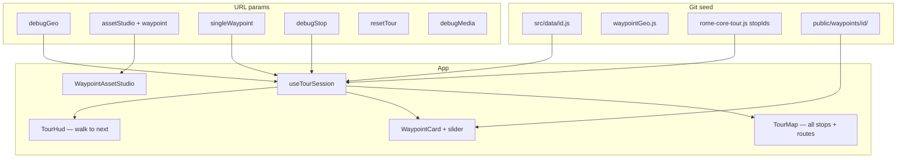

# ChronoWalk — Waypoint Playbook

**Checkpoint handoff doc** — repeatable workflow, corrected pitfalls, and links for agents + Gemini.  
**Last updated:** June 2026 · branch `cursor/chronowalk-setup-a224` · [PR #4](https://github.com/isienrione/pirisibits/pull/4)

**Quick links**
- **[TOUR_TEST_LINKS.md](./TOUR_TEST_LINKS.md)** — all tour / single-stop / Asset Studio / raw media URLs
- **[ASSET_STUDIO_LINKS.md](./ASSET_STUDIO_LINKS.md)** — prompt-generator bookmarks per stop
- **[docs/GEMINI_PROMPTS_EXPANSION.md](./docs/GEMINI_PROMPTS_EXPANSION.md)** — 4 prompts × 14 new waypoints (Forum, Capitoline, Campo, etc.)
- **[docs/AUDIO_PRODUCTION_PLAYBOOK.md](./docs/AUDIO_PRODUCTION_PLAYBOOK.md)** — agentic audio scripts, fact ledger, VO specs
- **[docs/AUDIO_SPRINT_ACTIVATION.md](./docs/AUDIO_SPRINT_ACTIVATION.md)** — **start here** to run the 3-day audio sprint
- [WAYPOINT_ASSET_PIPELINE.md](./WAYPOINT_ASSET_PIPELINE.md) — framing rules, quality bar, failures
- [CHRONOWALK_BUILD_STATE.md](./CHRONOWALK_BUILD_STATE.md) — deploy, env vars

---

## Checkpoint — where we are now

### Tour: `rome-core` (3 stops, 2 walking legs)

```
Colosseum  ──walk──►  Pantheon  ──walk──►  Piazza Navona
```

| # | Stop | `id` | Assets | Map / slider |
|---|------|------|--------|----------------|
| 1 | Colosseum | `colosseum` | ✅ Production | Reference site; `moderncolosseum.mp4` |
| 2 | Pantheon | `pantheon` | ✅ Production | Mid-piazza POV; `npm run process-pantheon` (swap) |
| 3 | Piazza Navona | `piazza-navona` | 🟡 **In production** | Code ✅ · Runway videos processed · still/audio may need polish |

### What’s built (engineering)

- Multi-stop **cumulative map** — all markers, zones, Mapbox walking routes
- **Tour HUD** — “Walk to {next}” after dismissing waypoint card
- **Transit audio** between stops; progress in `localStorage`
- **Asset Studio** — per-stop AI prompts from seed + viewpoint
- **URL modes** — full tour, jump to stop, single-stop, reset progress
- **Media safety** — local seed paths win; foreign Supabase URLs rejected; cache-bust on slider; verify warns on duplicate files

### Lessons learned (don’t repeat)

| Mistake | Fix |
|---------|-----|
| `?waypoint=pantheon` for tour test | Use `?singleWaypoint=` or `?debugStop=` — `waypoint=` is Asset Studio only |
| Pantheon swap script used for Navona | Default `process-waypoint` is **literal**; only Pantheon uses `SWAP_RUNWAY=1` |
| Copied pantheon JPG/MP4 into navona folder | Slider shows wrong landmark — verify warns `identical to pantheon` |
| Supabase row with pantheon media paths | `waypointMerge.js` ignores URLs for other stops’ folders |
| Browser cached old MP4 at same path | `media_cache_version` in seed + `?cwv=` on slider URLs |
| `resetTour=true` + `debugStop=` on old build | `debugStop` now wins — pull latest |
| Pasting `# comment` lines in terminal | zsh: `command not found: #` — paste commands only |

---

## Video processing rules (every new waypoint)

### Default — literal filenames

| `incoming/` file | Output | Content |
|------------------|--------|---------|
| `modern-source.mp4` | `modern.mp4` | Today |
| `ancient-source.mp4` | `ancient-reconstruction.mp4` | Ancient era |

```bash
npm run process-waypoint -- <id>
# Must print: Mapping: literal (ancient → ancient-reconstruction.mp4, modern → modern.mp4)
```

Shortcuts: `npm run process-piazza-navona` · `npm run verify-piazza-navona`

### Pantheon only — Runway mislabels

```bash
npm run process-pantheon   # sets SWAP_RUNWAY=1 internally
```

### After process

1. Export `modern-exterior.jpg` manually (Asset Studio → **Open Street View at viewpoint**)
2. `npm run verify-waypoint -- <id>` — fix any `⚠ identical to …` warnings
3. Bump `media_cache_version` in `src/data/<id>.js` if replacing media again

---

## All test & tour URLs (local dev)

**Base:** `http://localhost:5173/` · full tables in **[TOUR_TEST_LINKS.md](./TOUR_TEST_LINKS.md)**

### Cumulative tour (full map — 3 stops)

| Goal | URL |
|------|-----|
| Fresh start at Colosseum | http://localhost:5173/?resetTour=true&debugGeo=true |
| Resume saved progress | http://localhost:5173/?debugGeo=true |

### Jump to stop (full map, arrive at that stop)

| Stop | URL |
|------|-----|
| Colosseum | http://localhost:5173/?debugGeo=true&debugStop=colosseum |
| Pantheon | http://localhost:5173/?debugGeo=true&debugStop=pantheon |
| Piazza Navona | http://localhost:5173/?debugGeo=true&debugStop=piazza-navona |

### Single-stop only (fastest slider test)

| Stop | URL |
|------|-----|
| Colosseum | http://localhost:5173/?singleWaypoint=colosseum&debugGeo=true |
| Pantheon | http://localhost:5173/?singleWaypoint=pantheon&debugGeo=true |
| **Piazza Navona** | http://localhost:5173/?singleWaypoint=piazza-navona&debugGeo=true |
| Navona + media debug | http://localhost:5173/?singleWaypoint=piazza-navona&debugGeo=true&debugMedia=true |

### Asset Studio (prompts)

| Stop | URL |
|------|-----|
| Colosseum | http://localhost:5173/?assetStudio=true&waypoint=colosseum |
| Pantheon | http://localhost:5173/?assetStudio=true&waypoint=pantheon |
| Piazza Navona | http://localhost:5173/?assetStudio=true&waypoint=piazza-navona |

### Raw file check (no app)

```
http://localhost:5173/waypoints/piazza-navona/modern.mp4
http://localhost:5173/waypoints/piazza-navona/modern-exterior.jpg
```

---

## Architecture



**Two coordinate systems**

| Field | Used for |
|-------|----------|
| `lat`, `lng` | Map pin, geofence center |
| `viewpoint.{lat,lng,heading,pitch}` | Slider camera POV |

---

## Code touchpoints (new waypoint)

| Step | File | Action |
|------|------|--------|
| 0 | `public/waypoints/<id>/` | Folder + `incoming/` |
| 1 | `src/data/<id>.js` | Seed + `media_cache_version` |
| 2 | `src/services/waypointMerge.js` | `getLocalWaypoint()` |
| 3 | `src/data/waypointGeo.js` | Map/geofence/debug GPS |
| 4 | `src/data/rome-core-tour.js` | Insert in `stopIds` |
| 5 | `TOUR_TEST_LINKS.md` + `ASSET_STUDIO_LINKS.md` | Add test + studio URLs |
| 6 | `package.json` | Optional `process-<id>` / `verify-<id>` aliases |

No `App.jsx` changes — `useTourSession` loads all `stopIds` automatically.

---

## Agent workflow (phases 0–7)

### Phase 0 — Scaffold

```bash
# You are usually already in chronowalk/
git pull origin cursor/chronowalk-setup-a224
npm install

ID=piazza-navona
mkdir -p public/waypoints/$ID/incoming
cp scripts/templates/incoming-README.md public/waypoints/$ID/incoming/README.md
# Copy + edit src/data/pantheon.js → src/data/$ID.js
# Register: waypointMerge.js, waypointGeo.js, rome-core-tour.js stopIds
npm test
```

Asset Studio link (prompts auto-generate):

```
http://localhost:5173/?assetStudio=true&waypoint=<id>
```

### Phase 1 — Scout viewpoint

Asset Studio → **Open Street View at viewpoint** → framing check passes → record coords in seed.

### Phase 2–3 — Modern + ancient media

Copy prompts from Asset Studio. Export `modern-exterior.jpg` from Street View.

### Phase 4 — Audio

Placeholder OK: `Audio_sample.mp3` + `geocache-arrival-alert.wav`

### Phase 5 — Process & verify

```bash
npm run process-waypoint -- <id>
npm run verify-waypoint -- <id>
npm test && npm run build
```

### Phase 6 — Test

See [TOUR_TEST_LINKS.md](./TOUR_TEST_LINKS.md). For Navona slider only:

http://localhost:5173/?singleWaypoint=piazza-navona&debugGeo=true

### Phase 7 — Supabase (optional)

Local git seed wins for POV + media paths. Foreign `/waypoints/other-id/` URLs in Supabase are ignored.

---

## Seed file schema

```javascript
export const SITE_WAYPOINT = {
  id: 'piazza-navona',
  title: 'Piazza Navona',
  media_cache_version: 2,        // bump when replacing slider media
  framingProfile: 'compact_piazza', // or 'large_approach'
  arrival_headline, arrival_subtitle, immersive_orientation_hint,
  lat, lng, viewpoint: { lat, lng, heading, pitch },
  modern_image_url: '/waypoints/<id>/modern-exterior.jpg',
  modern_video_url: '/waypoints/<id>/modern.mp4',
  modern_poster_url: '/waypoints/<id>/modern-poster.jpg',
  ancient_image_url: '/waypoints/<id>/ancient-reconstruction.jpg',
  ancient_video_url: '/waypoints/<id>/ancient-reconstruction.mp4',
  ancient_poster_url: '/waypoints/<id>/ancient-poster.jpg',
  slider_poster_at_sec: 3,
  slider_post_animation_loop_ms: 10000,
  ambient_url, transit_narrative_url,
  arrival_immersive_url,        // required
  arrival_alert_url,
}
```

---

## Piazza Navona reference

| Item | Value |
|------|-------|
| `id` | `piazza-navona` |
| Ancient site | Stadium of Domitian |
| Landmark | `41.89918, 12.47306` |
| Viewpoint | `41.89878, 12.47302` · heading `2°` · pitch `18°` |
| Street View | https://www.google.com/maps/@?api=1&map_action=pano&viewpoint=41.89878,12.47302&heading=2&pitch=18 |
| Seed | `src/data/piazza-navona.js` |
| Process | `npm run process-piazza-navona` (literal, not swap) |
| Verify | `npm run verify-piazza-navona` |

---

## Scripts

| Command | Purpose |
|---------|---------|
| `npm run dev` | Local server :5173 |
| `npm run process-waypoint -- <id>` | Process Runway exports (literal) |
| `npm run verify-waypoint -- <id>` | Check files + duplicate warnings |
| `npm run process-piazza-navona` | Shorthand for Navona |
| `npm run verify-piazza-navona` | Shorthand for Navona |
| `npm run process-pantheon` | Pantheon only (`SWAP_RUNWAY=1`) |
| `npm test` | 57 tests |

---

## Tour visitor flow

1. Start screen → **Heart of Ancient Rome** · 3 stops
2. Map shows **all stops** + route to current target
3. Arrive → waypoint card → immersive slider
4. Dismiss card → **Walk to {next}** (TourHud)
5. Transit audio → next geofence

Progress: `localStorage` key `chronowalk:tour-progress:rome-core`

---

## Troubleshooting

| Symptom | Fix |
|---------|-----|
| `Missing script: process-waypoint` | `git pull` — you're on old branch |
| `zsh: command not found: #` | Don't paste comment lines from docs |
| `cd: no such file: chronowalk` | Already inside `chronowalk/` |
| Slider shows wrong stop | Open raw MP4 URL; run verify; bump `media_cache_version` |
| Tour starts at Colosseum not Navona | Use `singleWaypoint=piazza-navona` or `debugStop=piazza-navona` |
| Netlify shows old media | `git push` the `public/waypoints/` files |
| CDN in `.env` | Unset `VITE_CDN_BASE_URL` for local iteration |

---

## Gemini handoff — paste this block

```
PROJECT: ChronoWalk — location-aware Rome walking tour PWA
STACK: React 19, Vite, Mapbox GL, Tailwind, Vitest
REPO: github.com/isienrione/pirisibits
FOLDER: chronowalk/
BRANCH: cursor/chronowalk-setup-a224
PR: #4

=== CHECKPOINT (June 2026) ===

TOUR id: rome-core
STOPS (in order): colosseum → pantheon → piazza-navona (3 stops, 2 walking legs)
SUBTITLE: Colosseum → Pantheon → Piazza Navona

ENGINEERING DONE:
- Cumulative map: all markers, geofence zones, Mapbox walking routes between stops
- Tour HUD: "Walk to {next}" appears AFTER visitor dismisses waypoint card
- Transit audio, localStorage progress, multi-stop waypoint loading
- Asset Studio per stop: ?assetStudio=true&waypoint=<id>
- URL modes corrected (see below)

STOP STATUS:
1. colosseum — PRODUCTION. large_approach. Video: moderncolosseum.mp4
2. pantheon — PRODUCTION. compact_piazza, mid-piazza POV rescout. process-pantheon uses SWAP_RUNWAY=1 (Runway mislabeled filenames)
3. piazza-navona — IN PRODUCTION. Code complete. Viewpoint: 41.89878, 12.47302, h2°, pitch 18°. Ancient: Stadium of Domitian. User has processed Runway videos with literal mapping. May still need: final modern-exterior.jpg polish, real narration audio, Netlify push of media files.

KEY DOCS IN REPO:
- WAYPOINT_PLAYBOOK.md (this checkpoint)
- TOUR_TEST_LINKS.md (all test URLs)
- ASSET_STUDIO_LINKS.md (prompt links)
- WAYPOINT_ASSET_PIPELINE.md (framing quality bar)

=== VIDEO PROCESSING (CORRECTED) ===

DEFAULT (all waypoints EXCEPT Pantheon):
  incoming/modern-source.mp4  → modern.mp4 (today)
  incoming/ancient-source.mp4 → ancient-reconstruction.mp4 (ancient)
  Command: npm run process-waypoint -- <id>
  Must see: "Mapping: literal"

PANTHEON ONLY:
  npm run process-pantheon  (SWAP_RUNWAY=1 — Runway filenames were backwards)

NEVER copy JPG/MP4 from another stop's folder. verify-waypoint warns if byte-identical.

modern-exterior.jpg: manual Street View export (Asset Studio → Open Street View at viewpoint)

After replacing media: bump media_cache_version in src/data/<id>.js

=== URL PARAMETERS (CORRECTED) ===

?debugGeo=true              — fake GPS (required on desktop)
?resetTour=true             — clear saved progress, start Colosseum
?debugStop=<id>             — full tour MAP, arrive at that stop
?singleWaypoint=<id>        — ONE stop only (fastest slider test)
?assetStudio=true&waypoint=<id> — AI prompts (waypoint= is NOT tour mode)
?debugMedia=true            — show slider URLs on card

DO NOT use ?waypoint= for tour testing.

=== TEST LINKS (localhost:5173) ===

Full tour fresh:        /?resetTour=true&debugGeo=true
Full tour resume:       /?debugGeo=true
Jump to Colosseum:      /?debugGeo=true&debugStop=colosseum
Jump to Pantheon:       /?debugGeo=true&debugStop=pantheon
Jump to Piazza Navona:  /?debugGeo=true&debugStop=piazza-navona

Single-stop Colosseum:  /?singleWaypoint=colosseum&debugGeo=true
Single-stop Pantheon:   /?singleWaypoint=pantheon&debugGeo=true
Single-stop Navona:     /?singleWaypoint=piazza-navona&debugGeo=true
Navona + media debug:   /?singleWaypoint=piazza-navona&debugGeo=true&debugMedia=true

Asset Studio Navona:    /?assetStudio=true&waypoint=piazza-navona
Raw Navona video:       /waypoints/piazza-navona/modern.mp4

=== CODE TOUCHPOINTS (new waypoint) ===

1. src/data/<id>.js
2. src/services/waypointMerge.js → getLocalWaypoint()
3. src/data/waypointGeo.js
4. src/data/rome-core-tour.js → stopIds (insert in walk order)
5. public/waypoints/<id>/ + incoming/
6. Add rows to TOUR_TEST_LINKS.md + ASSET_STUDIO_LINKS.md
7. npm run process-waypoint -- <id> && npm run verify-waypoint -- <id>

No App.jsx changes needed.

=== NEXT TASKS FOR NAVONA ===

1. Confirm raw MP4 in browser shows Navona (not Pantheon)
2. npm run verify-piazza-navona — no "identical to pantheon" warnings
3. Test: ?singleWaypoint=piazza-navona&debugGeo=true&debugMedia=true
4. Record arrival/transit audio; replace Audio_sample.mp3
5. git add public/waypoints/piazza-navona/ && push for Netlify
6. Future: add waypoint #4 using same pipeline (literal process, not pantheon swap)

=== GEMINI ASSET TASK TEMPLATE ===

When generating Runway/Midjourney assets for piazza-navona:
- Stand at 41.89878, 12.47302, heading 2°, pitch 18° (south piazza, facing north)
- Modern: today's baroque Piazza Navona with fountains
- Ancient: Stadium of Domitian (Circus Agonalis), same camera lock
- 16:9, ~5s, no camera movement
- Save as incoming/modern-source.mp4 and incoming/ancient-source.mp4
- Then: npm run process-piazza-navona
```

---

## Agent one-liner (new Cursor session)

```
Continue ChronoWalk on branch cursor/chronowalk-setup-a224.
Read WAYPOINT_PLAYBOOK.md + TOUR_TEST_LINKS.md.
Tour: colosseum → pantheon → piazza-navona.
Add waypoint "<id>" using literal process-waypoint mapping (not Pantheon swap).
Register in stopIds, verify assets, add test URLs to TOUR_TEST_LINKS.md.
```
