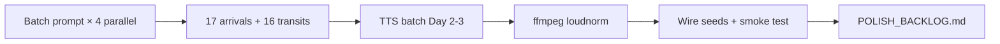

# ChronoWalk — Audio scripts & production playbook

**Agentic workflow** for historically rigorous, engaging narration — tuned to how the app actually plays audio today.

**Sprint mode:** **3 days** to first-ship all Rome audio (scripts + MP3s). Polish, fact-deepening, and human re-records happen **after** every waypoint has slider media.

**Related:** [WAYPOINT_PLAYBOOK.md](../WAYPOINT_PLAYBOOK.md) · [GEMINI_PROMPTS_EXPANSION.md](./GEMINI_PROMPTS_EXPANSION.md) · [WAYPOINT_ASSET_PIPELINE.md](../WAYPOINT_ASSET_PIPELINE.md)

**Branch:** `cursor/chronowalk-setup-a224`

---

## 3-day sprint plan (primary workflow)

**Goal:** Replace every `Audio_sample.mp3` placeholder with real **`arrival.mp3`** + **`transit.mp3`** for all Rome stops (3 live + 14 expansion = **17 waypoints**, **16 transit legs**). Skip ambient. One shared `geocache-arrival-alert.wav`.

**Strategy:** One TTS voice, template-driven scripts, parallel AI batches, **lite fact-check** now → **full polish pass** when visuals are done.

| Day | Focus | Output |
|-----|-------|--------|
| **Day 1** | Pipeline + batch scripts | TTS voice locked · master prompt template · **all 17 `arrival.script.md`** · **16 `transit.script.md`** · wire live tour seeds (3 stops) |
| **Day 2** | Audio generation | **All `arrival.mp3`** · batch loudness normalize · smoke-test 3 live stops in app |
| **Day 3** | Transits + integration | **All `transit.mp3`** · update every `src/data/<id>.js` · full tour walk-through · `v1-polish` backlog file |

### What ships in 3 days vs later

| Ship now (3 days) | Polish later (post–all-waypoints) |
|-------------------|-----------------------------------|
| `arrival.mp3` + `transit.mp3` per stop | Human re-record hero stops (Colosseum, Pantheon) |
| One ElevenLabs / OpenAI voice (locked settings) | Per-stop ambient beds |
| Inline mini-fact notes per script (3–5 sourced claims) | Full `facts.yaml` + `factcheck.md` per stop |
| App smoke test per stop (`?singleWaypoint=`) | 3-listener outdoor engagement test |
| Reuse existing arrival alert WAV | Custom alert per landmark |
| 60–90 s arrivals, 45–75 s Forum transits | Lengthen pantheon transit when you have walk time |

### Day 1 — Scripts (parallel batches)

Run **4 AI sessions in parallel** (one per batch). Each session: research → script → self fact-check in **one pass** — no separate outline agent.

| Batch | Stops | Parallel session |
|-------|-------|------------------|
| A | colosseum, pantheon, piazza-navona | Session 1 — live tour, highest care |
| B | forum-arch-titus, forum-basilica-maxentius, forum-via-sacra, forum-temple-vesta | Session 2 |
| C | forum-temple-saturn, forum-curia-julia, forum-arch-severus, forum-rostra | Session 3 |
| D | capitoline-hill, campo-de-fiori, trajan-market, castel-sant-angelo, circus-maximus, appian-way | Session 4 |

**Per stop (~20 min with AI):**

1. Paste [sprint script prompt](#sprint-script-prompt-copy-paste) + waypoint block from [GEMINI_PROMPTS_EXPANSION.md](./GEMINI_PROMPTS_EXPANSION.md)
2. Save `content/<id>/arrival.script.md` (~120–150 words, **60–75 s**)
3. Save `content/<id>/transit.script.md` (~80–120 words, **45–60 s**) — skip transit for `colosseum` (tour start)
4. Bottom of file: `claims:` bullet list with source (one line each) — enough for sprint, expand later

**Day 1 end checklist**

- [ ] 17 arrival scripts
- [ ] 16 transit scripts (all except colosseum approach)
- [ ] TTS voice ID + speed locked in a note (`content/VOICE_SETTINGS.md`)
- [ ] `src/data/colosseum.js` … `piazza-navona.js` point at `/waypoints/<id>/arrival.mp3` (not `Audio_sample.mp3`)

### Day 2 — Arrival audio

**Batch TTS** (ElevenLabs recommended: one voice, stability ~0.65, similarity ~0.75, speed 1.0–1.05 for outdoor clarity).

```bash
# Per stop after TTS export
npm run normalize-audio -- colosseum arrival
npm run normalize-audio -- pantheon transit
# Expects public/waypoints/<id>/arrival-raw.wav (or .mp3) → writes arrival.mp3
```

**Target:** 17 `public/waypoints/<id>/arrival.mp3` by end of day.

**Smoke test (15 min):**

```
http://localhost:5173/?singleWaypoint=colosseum&debugGeo=true
http://localhost:5173/?singleWaypoint=pantheon&debugGeo=true
http://localhost:5173/?singleWaypoint=piazza-navona&debugGeo=true
```

Tap **Begin Immersive View** — slider should reveal on first “look at…” line.

### Day 3 — Transit audio + wire + tour test

1. Batch TTS all `transit.script.md` → `public/waypoints/<id>/transit.mp3`
2. Update seeds for expansion stops as they get scaffolded (or pre-wire paths even if slider pending)
3. Full tour: `?resetTour=true&debugGeo=true` — walk Colosseum → Pantheon → Navona with transit playing
4. Create `content/POLISH_BACKLOG.md` — list weak scripts, unsourced claims, pronunciation fixes

**If behind on Day 3:** ship Tier A only (3 live stops complete), generate remaining arrivals without transits — transits are lower priority than arrival immersion.

---

## Sprint script prompt (copy-paste)

Give this to Gemini / Claude per waypoint:

```
You write ChronoWalk audio for a Rome walking tour PWA.

WAYPOINT:
- id: <id>
- title: <title>
- viewpoint: <lat>, <lng>, heading <h>°, pitch <p>°
- ancient layer: <ancient target>
- previous stop: <fromId or "tour start">
- next stop: <toId or "tour end">

RULES:
- Second person, present tense, conversational (Rick Steves energy, original words only)
- arrival: 120-150 words, hook in first sentence with a visual command matching the slider POV
- Include one line: "Drag the slider" or "Slide between then and now" (~40% through arrival)
- transit (if not tour start): 80-120 words, "As you walk toward <next title>...", one hidden-Rome detail on the route
- No exact gladiator/animal kill counts; no "Rome fell because..."
- End claims section with 3-5 bullets: fact + source (short)

OUTPUT:
## arrival.script.md
(narration only)

## transit.script.md
(narration only, or "N/A tour start")

## claims
- ...
```

---

## Sprint mode: simplified pipeline

**Skip for 3 days:** separate outline agent, read-aloud agent, full `facts.yaml`, engagement beta, ambient, custom SFX mixes.

**Keep:** destination-stop transit convention, slider sync beat, −16 LUFS, one voice.



### Lite fact-check (5 min per stop, not 45)

During script generation, require the `claims` footer. Before TTS, skim only:

- [ ] No copied sentences from commercial guides
- [ ] Visual hook matches slider POV from seed
- [ ] No claims from the [avoid list](#fixes-to-apply-to-the-draft-example-scripts)
- [ ] Transit says “toward {this stop’s title}” on the **destination** id file

Full ledger + outdoor listener tests → **polish pass** when all waypoint videos are in.

---

## Verdict on the proposed workflow

Your proposal is **directionally excellent**: two-track scripting (stop vs walk), fact ledger, conversational tone, legal awareness, and QA gates are all industry-standard for premium audio guides.

**What to keep as-is**

- Copyright-safe research hierarchy (primary texts, Parco archeologico, peer-reviewed secondary)
- Rick Steves–inspired *structure* (orientation → story → human detail → transition) without copying voice or scripts
- Separate **waypoint** vs **transit** narrative arcs
- Fact-checking before recording — non-negotiable for Rome content
- Outdoor listening specs (compression, LUFS, clarity at street noise)

**What to change for ChronoWalk**

| Proposal element | Issue | ChronoWalk adjustment |
|------------------|-------|------------------------|
| 22-week timeline | Serial agency scale | **3-day sprint** — TTS batch, parallel script sessions, polish later |
| Colosseum exterior + interior as separate waypoints | App = **one geofence + one slider per `id`** | Split only if you add a second seed (`colosseum-interior`) with its own coords |
| Phase 4 Visual Recreation Engine | Duplicates Gemini slider pipeline | **Drop** — visual layer is `modern.mp4` / `ancient-reconstruction.mp4` |
| Gamification (quizzes, badges, Easter eggs) | Not in audio orchestrator | **Defer to v2** — ship narration first |
| Inline `[SFX: …]` in scripts | `AudioOrchestrator` plays **one MP3 per mode** | Bake SFX/ambience in post, or use a quiet loop on `ambient_url` |
| Transit on *previous* stop | App plays **`nextWaypoint.transit_narrative_url`** when user taps “Walk to next” | Author transit as **“approach to {destination}”** on the **destination** waypoint seed |
| 90–180 s waypoint + 60–120 s transit | Can exceed walk time or fatigue listeners | **Duration budget from Mapbox leg minutes** (see below) |
| “100–135 words per stop” vs 90–180 s | Contradictory (~130 wpm → 90 s ≈ **195 words**) | Pick **duration first**, then word cap |
| Sensational claims in examples | Legal + credibility risk | Soften or source: inauguration kill counts vary; avoid “Rome fell because…” |

---

## How audio maps to the app (read this first)

Each waypoint seed exposes **four files**:

| File | Seed field | When it plays |
|------|------------|---------------|
| `arrival.mp3` | `arrival_immersive_url` | User taps **Begin Immersive View** or **Play audio** on waypoint card |
| `transit.mp3` | `transit_narrative_url` | User taps **Walk to {next}** — plays en route to **this** stop (loaded from *next* waypoint) |
| `ambient.mp3` | `ambient_url` | Optional loop at tour start / background (low priority for MVP) |
| `geocache-arrival-alert.wav` | `arrival_alert_url` | Short chime at geofence entry (~30 m) |

**Critical sync:** Arrival narration triggers the before/after slider ~250 ms after playback starts (`AUDIO_SYNC_TRIGGER`). Write arrival scripts so the **first visual cue** lands in the **first 5–8 seconds** — visitors see the card, hit play, then the slider reveals on the “look at this” beat.

**Transit wiring** (`useTourSession.beginTransitToNextStop`):

```
Colosseum → Pantheon walk uses pantheon.transit_narrative_url
Pantheon → Navona walk uses piazza-navona.transit_narrative_url
```

Author transit copy as: *“As you walk toward the Pantheon…”* and store it on **`pantheon`**, not `colosseum`.

---

## Duration budgeting (sprint vs polish)

### Sprint (3 days) — shorter, still engaging

| Type | Target | Words (~130 wpm) |
|------|--------|------------------|
| Arrival | **60–75 s** | 120–150 |
| Transit (long leg) | **90–120 s** | 150–200 |
| Transit (Forum hop) | **45–60 s** | 80–100 |

One hook, one visual anchor, one wow fact, slider cue — **no sixth act**.

### Polish pass (later) — expand when visuals ready

| Leg (example) | Walk ~min | Transit target | Waypoint arrival target |
|---------------|-----------|----------------|-------------------------|
| Colosseum → Pantheon | ~25–35 | 2:00–2:30 | 1:30–2:00 |
| Pantheon → Piazza Navona | ~8–12 | 1:00–1:30 | 1:30–2:00 |
| Forum cluster hop | ~3–6 | 0:45–1:15 | 1:15–1:45 |

**Rule (polish):** Transit length ≤ **80% of Mapbox walking time** for that leg.

---

## The lean agentic pipeline (polish pass)

Use this **after** the 3-day sprint when all waypoint sliders exist. Six agents, one **Fact Ledger** per stop.


<details>
<summary>Full agent specs (expand after sprint)</summary>

### Agent 1 — Research

**Input:** waypoint `id`, coordinates, slider ancient target  
**Output:** `content/<id>/facts.yaml`

```yaml
id: colosseum
title: The Colosseum
ancient_era_label: "80 AD (inauguration games)"
claims:
  - id: velarium_sailors
    narration: "The awning was handled by sailors from the fleet at Misenum."
    confidence: high
    sources:
      - "Suetonius, Claud. 21 (velarium)"
      - "Cassius Dio 66.25"
  - id: iron_clamps
    narration: "Medieval scavengers pried out iron clamps, leaving pockmarks in the travertine."
    confidence: high
    sources:
      - "Amanda Claridge, Rome: An Oxford Archaeological Guide"
avoid:
  - "Exact kill counts for inaugural games" # figures vary by source; use "hundreds" or cite range
  - "Rome fell because X" # single-cause fall narratives
trivia_candidates:
  - "arena ← harena (sand)"
  - "planned wool factory under Sixtus V (never built)"
visual_anchors:
  - "holes in travertine at eye level"
  - "hypogeum visible from arena floor level"
```

**Source tiers (use in order):**

1. Site authorities: Parco Colosseo, Parco archeologico del Colosseo, Sovrintendenza
2. Primary texts (public domain): Suetonius, Cassius Dio, Pliny, Livy
3. Reference works: Claridge, Coarelli, Platner & Ashby
4. Inspiration only: Rick Steves, VoiceMap, Action Tour Guide (**structure**, not sentences)

### Agent 2 — Outline

**Input:** facts.yaml + leg context (from, to, walk minutes)  
**Output:** `content/<id>/outline.md`

Waypoint outline blocks (fixed):

1. **Hook** (1 sentence, present tense, “you are here”)
2. **Visual anchor** (what to look at *now* — matches slider POV)
3. **Time machine** (one era shift, tied to ancient reconstruction)
4. **Human story** (one named person, ritual, or sensory detail)
5. **Obscure wow** (one fact from `trivia_candidates`, ledger-backed)
6. **Slider cue** (`[SLIDER_REVEAL]` — “Drag the slider…” or “Watch the façade rebuild…”)
7. **Transition** (optional on last stop; else hand off to map / Walk to next)

Transit outline blocks:

1. **Movement** (“Keep the cobbles on your left…”)
2. **Thread** (link previous stop theme to next)
3. **Hidden layer** (one thing visible on the walk)
4. **Anticipation** (“In about a minute, you’ll see…”)

### Agent 3 — Script

**Input:** outline + word cap  
**Output:** `content/<id>/arrival.script.md`, `content/<id>/transit.script.md`

**Delivery format** — plain narration only in recording script; production notes in comments:

```markdown
---
target_duration_sec: 105
word_count: 198
voice: primary_narrator
---

Stop here at the outer ring. Look at the travertine — see those square holes?

They held iron clamps. Scavengers pulled them out centuries ago. That's why the wall looks punched full of sockets.

[ELEVEN: warm, slight smile]

In eighty AD, this place could hold tens of thousands. Games ran for a hundred days at the opening — a spectacle Rome had never seen at this scale.

[SLIDER_REVEAL]
Now drag the slider. Same stones — but the upper tiers intact, awnings rigged, the crowd noise you'd have heard from exactly where you're standing.

One word you use every week comes from here: arena, from harena — sand. They spread it over the wooden floor to soak what the games left behind.

When you're ready, open the map and head toward our next stop.
```

**Tone rules**

- Second person, present tense, **one idea per sentence**
- No academic hedging in audio (“scholars debate…” → pick the mainstream view or say “most historians…”)
- **Fun ≠ fiction** — vivid yes, invented dialogue no
- Name **one** date or number per minute max (listener retention)

### Agent 4 — Fact-check

**Input:** script + facts.yaml  
**Output:** annotated script + `content/<id>/factcheck.md`

Checklist:

- [ ] Every historical claim maps to a ledger `claims[].id`
- [ ] No claim in `avoid` list
- [ ] Visual anchors match `viewpoint` / slider POV
- [ ] Transit directions match real walking path (spot-check on Google Maps / Mapbox)
- [ ] Plagiarism: no 8+ word string match to commercial guides (manual or `diff` against notes)

### Agent 5 — Read-aloud

**Input:** final script  
**Output:** timing report

- TTS dry run (ElevenLabs / OpenAI) at final speed
- Flag sentences > 20 words
- Flag tongue-twisters (Latin names back-to-back)
- Target: **within ±10% of duration budget**

### Agent 6 — Production & master

See [Production specs](#production-specs) below. Output files into `public/waypoints/<id>/`.

</details>

---

## Script templates (copy-paste)

### Waypoint — arrival (`arrival.mp3`)

| Block | Sec | Purpose |
|-------|-----|---------|
| Hook | 0–5 | Stop + single visual command |
| Anchor | 5–25 | Describe only what’s in frame |
| Time machine | 25–70 | Era shift → ties to ancient video |
| Human / wow | 70–95 | One story or obscure fact |
| Slider + close | 95–110 | `[SLIDER_REVEAL]` + optional “when ready” |

### Transit — approach (`transit.mp3` on **destination** id)

| Block | Sec | Purpose |
|-------|-----|---------|
| Movement cue | 0–10 | Feet, direction, safety |
| Thread | 10–40 | Thematic bridge from last stop |
| Hidden Rome | 40–70 | One facades / layer detail on route |
| Anticipation | 70–end | “You’ll know you’ve arrived when…” |

---

## Example: Pantheon arrival (ledger-safe draft)

**~185 words · ~1:30**

> You're in the piazza, facing the portico. That granite row out front? Each column is a single stone hauled from Egypt — a flex of imperial logistics, not just architecture.
>
> The bronze letters on the pediment once read a dedication to Marcus Agrippa. What you see today is mostly Hadrian's rebuilding — he kept the old inscription out of respect, or politics, or both.
>
> Look up at the dome. It's still the world's largest unreinforced concrete span after nearly two millennia. The oculus isn't decoration — it's the building's lantern, rain and all. Stand under it on a wet day and you'll believe in Roman engineering fast.
>
> Drag the slider: same viewpoint, but the neighborhood behind it melts away — temples, open sky, the city when this was a temple to all the gods, not a church.
>
> When you're ready, explore the floor — or open the map for our next walk.

---

## Voice strategy: 3-day sprint vs polish

### Sprint (all 3 days) — TTS only

| Setting | Value |
|---------|-------|
| Tool | ElevenLabs or OpenAI TTS |
| Voices | **One** narrator for all 17 stops |
| Human VO | **None** in sprint — add Colosseum/Pantheon re-record in polish pass |
| Italian names | Quick pass: Vespasian, Agrippa, Septimius — fix in `POLISH_BACKLOG.md` |
| Speed | 1.0–1.05× (clarity over drama) |

Lock settings in `content/VOICE_SETTINGS.md` on Day 1 so Day 2–3 batches match.

### Polish pass (later)

| Tier | Use | Tool |
|------|-----|------|
| **Hero stops** (Colosseum, Pantheon) | Human VO or voice clone | Studio or ElevenLabs PVC |
| **Batch stops** | Re-export TTS with longer scripts | Same voice ID |
| **Patches** | TTS sentence replace | Locked voice ID |

---

## Production specs

### Recording

- **48 kHz / 24-bit WAV** master
- Deliver **MP3** to app: **128 kbps CBR** or **96 kbps** (smaller offline bundle)
- Mono or stereo: **mono** is fine for voice; stereo only if ambiences are wide

### Mix chain

1. High-pass ~80 Hz on voice
2. De-ess lightly
3. Compression **2:1**, slow attack — intelligibility in traffic
4. **Integrated loudness −16 LUFS** (mobile podcast standard)
5. True peak **≤ −1 dBTP**
6. Optional: **−18 to −22 dB** ambience bed under voice in transit (pre-mixed into `transit.mp3`)

### File naming (matches existing seeds)

```
public/waypoints/<id>/
  arrival.mp3              → arrival_immersive_url
  transit.mp3              → transit_narrative_url   # "approach to THIS stop"
  ambient.mp3              → ambient_url             # optional
  geocache-arrival-alert.wav → arrival_alert_url
```

Placeholder today: `Audio_sample.mp3` on all fields — replace per file.

### Arrival alert

Keep **< 1.5 s**, no voice, distinct from notification sounds. Same file can be reused across stops or customized per landmark.

---

## Forum cluster: batch efficiency

For 8 Forum stops, don’t write 8 isolated operas:

1. **One** Forum “super-outline” for chronological thread (kingdom → republic → empire).
2. Per-stop script gets **one unique wow** + **one visual anchor**; thread line is lighter.
3. Transit between Forum stops can be **shorter** (45–75 s) — visitor is already in archaeological zone.
4. Shared `facts-forum-common.yaml` for Cloaca Maxima, Campo Vaccino nickname, Via Sacra processions.

---

## QA

### Sprint (3 days) — smoke test only

| Gate | Method | Pass |
|------|--------|------|
| Files exist | `ls public/waypoints/<id>/arrival.mp3` | 17 arrivals |
| Loudness | ffmpeg loudnorm batch | −16 LUFS ±1 |
| App sync | `?singleWaypoint=<id>&debugGeo=true` | Audio plays; slider reveals |
| Transit | Full tour `?resetTour=true&debugGeo=true` | Transit plays on “Walk to next” |
| Claims footer | Each script has 3+ sourced bullets | No empty scripts |

### Polish pass (later)

| Gate | Method | Pass |
|------|--------|------|
| Historical | Full fact ledger 100% mapped | No orphan claims |
| Legal | Original prose + PD sources | No copied guide paragraphs |
| Engagement | 3 listeners, phone speaker, outdoors | ≥ 2/3 finish without skip |
| Clarity | 85 dB ambient noise simulation | Proper nouns intelligible |
| Bundle | `du -sh public/waypoints/` | Acceptable download size |

---

## What to defer (still good ideas, wrong phase)

- Quizzes / Centurion’s Challenge
- AR pose mode
- Multilingual tiers
- Per-leg `transit_narrative_url` on tour leg objects (code change) — until you need different copy per direction
- Full transcript UI — add `arrival_transcript` text field in seed when you build captions

---

## Production order

### 3-day sprint (do this now)

| Order | Stops | Why |
|-------|-------|-----|
| **Day 1 AM** | colosseum, pantheon, piazza-navona scripts | Live tour — test pipeline |
| **Day 1 PM** | Forum batch B + C (8 scripts) | Shared tone, parallel AI |
| **Day 1 eve** | Batch D (6 scripts) | Remaining expansion |
| **Day 2** | All arrivals → MP3 | Highest user impact |
| **Day 3** | All transits → MP3 + seed wiring | Tour flow complete |

### Polish pass (after all waypoint videos ready)

| Wave | Stops | Action |
|------|-------|--------|
| **1** | colosseum, pantheon, piazza-navona | Lengthen scripts + optional human VO |
| **2** | Forum cluster | Full `facts.yaml`, thread refinement |
| **3** | Standalone stops | Long-leg transits (Castel, Appian) |

---

## Repo layout

```
chronowalk/
  content/
    VOICE_SETTINGS.md          # Day 1 — locked TTS params
    POLISH_BACKLOG.md          # Day 3 — items to fix after visuals done
    facts-forum-common.yaml    # optional shared research
    <id>/
      arrival.script.md
      transit.script.md        # omit for colosseum
  public/waypoints/<id>/
    arrival.mp3
    transit.mp3
    geocache-arrival-alert.wav # reuse one file across stops in sprint
```

Wire paths in `src/data/<id>.js` — same pattern as [WAYPOINT_ASSET_PIPELINE.md](../WAYPOINT_ASSET_PIPELINE.md#phase-5--audio-assets).

---

## Agent one-liner (3-day sprint)

```
3-DAY SPRINT — read chronowalk/docs/AUDIO_PRODUCTION_PLAYBOOK.md § 3-day sprint.
Day 1: parallel batches A–D → content/<id>/arrival.script.md + transit.script.md (claims footer).
Day 2: TTS → public/waypoints/<id>/arrival.mp3, ffmpeg loudnorm -16 LUFS.
Day 3: transit MP3s, wire src/data/<id>.js, smoke-test tour, write content/POLISH_BACKLOG.md.
Skip ambient, skip full facts.yaml until polish pass.
```

## Agent one-liner (polish pass)

```
Read chronowalk/docs/AUDIO_PRODUCTION_PLAYBOOK.md + content/POLISH_BACKLOG.md.
Expand facts.yaml, lengthen scripts, optional human VO for hero stops.
Re-master MP3s. Full QA table.
```

---

## Fixes to apply to the draft example scripts

| Line in proposal | Issue | Safer version |
|------------------|-------|---------------|
| “5,000 animals and 2,000 gladiators” | Sources disagree | “Hundreds of animals and many gladiatorial bouts over a hundred days” |
| “300 TONS of iron clamps” | Needs citation | “Tons of iron clamps” + ledger source |
| Vestal fire → “Rome fell not long after” | Causal oversimplification | “The cult ended under Theodosius; the temple was gone within decades” |
| “bullet holes” joke | Fine for tone | Keep — clearly rhetorical |
| Sixtus V wool factory | Good obscure fact | Keep — verify via ledger |

---

## Summary

**3-day sprint:** parallel script batches → one TTS voice → batch MP3 → wire seeds → smoke test. **Polish later** when every waypoint has slider video.

Highest-leverage rules (unchanged):

1. **Align to four audio slots** — transit on **destination** stop.
2. **Sprint = shorter scripts** (60–75 s arrival); expand in polish pass.
3. **Claims footer** on every script now; full ledger later.
4. **One TTS voice** for 3 days; human hero stops later.
5. **Slider sync** — visual command in first 5–8 s.
6. **Skip ambient / gamification / SFX layers** until v2.

Ship **arrival** MP3s Day 2, **transit** MP3s Day 3. Everything else waits for the post-visual polish pass.
