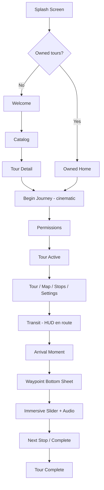

# ChronoWalk — Figma Design Transfer

> **Status:** Live Figma MCP read is **still blocked** in this Cloud Agent session (server reports connection error; tools like `whoami` and `get_design_context` are unavailable). Activating MCP in **Cursor Desktop** does not automatically authenticate the **Cloud Agent** VM — they are separate environments.
>
> **Target file (user-specified):** Figma Make project folder `chronowalk` → file **`ChronoWalk mobile prototype.make`**
>
> **To complete the live sync, provide:**
> 1. The **Make project URL** copied from Figma (e.g. `https://www.figma.com/make/<projectKey>/...`)
> 2. Run the read in **Cursor Desktop Agent** (not Cloud Agent), where your Figma MCP auth is active
>
> For Make files, the agent should use MCP **resources** to list project files, then `get_design_context` (supported for Figma Make) to export code and structure.

**Last assembled:** July 6, 2026  
**Repo branch at assembly:** `figma` (same commit as `main`)  
**App path:** `chronowalk/`

---

## 1. Design direction

ChronoWalk uses a **luxury travel** visual language:

- Warm ivory/parchment surfaces, deep slate text, gold progress accents, bronze/terracotta primary actions
- **Fraunces** display type + **DM Sans** UI type
- Glass panels, floating bottom navigation (mobile), left icon rail (desktop ≥ lg)
- Cinematic arrival moments, dark obsidian audio player, bottom-sheet landmark cards
- Respects `prefers-reduced-motion` for all animations

---

## 2. Design tokens

### 2.1 Color palette

| Token | Hex | Usage |
|-------|-----|-------|
| `ivory` / `warm-white` | `#F7F3EC` | Primary surface, page backgrounds |
| `parchment` | `#EDE3CF` | Secondary surface, cards, gradients |
| `sand` / `limestone` | `#E2D6BE` | Tertiary surface, locked states |
| `deep-slate` | `#17212B` | Primary text |
| `soft-slate` | `#686E72` | Secondary text, metadata |
| `obsidian` | `#1C1C1C` | Dark panels (audio player, cinematic screens) |
| `bronze` / `terracotta` | `#A8742A` | Primary CTA, route lines, eyebrows |
| `gold` | `#D4AF37` | Progress, accents, arrival moments |
| `olive` | `#7A8B5A` | Arrived / success states |
| `sky-blue` | `#7CB7D8` | Map / informational accents |

**Source files:** `src/design/tokens.js`, `src/index.css` (`:root`), `tailwind.config.js`

### 2.2 Typography

| Role | Family | Notes |
|------|--------|-------|
| Display / editorial | Fraunces | Headlines, tour titles, landmark names |
| UI / body | DM Sans | Buttons, labels, body copy |
| Eyebrow | DM Sans 600 | `0.6875rem`, `letter-spacing: 0.18em`, uppercase |

### 2.3 Spacing & layout

| Token | Value |
|-------|-------|
| Page max width | `max-w-2xl` (672px) |
| Page horizontal padding | `px-6` |
| Bottom nav clearance | `5.5rem` + safe-area + audio bar inset |
| Sheet border radius | `2rem` (`rounded-sheet`) |
| Panel border radius | `1.25rem` (`rounded-panel`) |
| Card border radius | `rounded-3xl` |

### 2.4 Shadows

| Token | Value |
|-------|-------|
| `glass` | `0 8px 32px rgba(28,28,28,0.1), 0 2px 8px rgba(28,28,28,0.05)` |
| `plaque` | `0 4px 24px rgba(28,28,28,0.08), 0 1px 3px rgba(28,28,28,0.04)` |
| `plaque-lg` | `0 12px 40px rgba(28,28,28,0.12), 0 4px 12px rgba(28,28,28,0.06)` |
| `sheet-up` | `0 -12px 40px rgba(28,28,28,0.14)` |
| `bronze-cta` | `0 8px 24px rgba(168,116,42,0.28), inset 0 1px 0 rgba(255,253,248,0.15)` |
| `gold-glow` | `0 0 32px rgba(212,175,55,0.22)` |

### 2.5 Motion

| Token | Value |
|-------|-------|
| Spring easing | `cubic-bezier(0.22, 1, 0.36, 1)` |
| Spring duration | `0.65s` |
| Sheet enter | `sheet-enter` 0.5s spring |
| Splash duration | 2000ms visible + 650ms fade |

**Keyframe animations:** `arrival-vignette`, `arrival-discover`, `arrival-map-pulse`, `arrival-title-glow`, `sheet-rise`, `medallion-breathe`, `splash-dust`

All animations disabled under `prefers-reduced-motion: reduce`.

### 2.6 Textures

- **Paper texture:** SVG fractal noise overlay at ~3.5–4.5% opacity (`.paper-texture`, `.grain-overlay`)
- **Glass panels:** `backdrop-blur-glass` (16px) + semi-transparent ivory background

---

## 3. Component library

### 3.1 Primitives (`src/components/ui/`)

| Component | Description |
|-----------|-------------|
| `Button` | Variants: `primary`, `secondary`, `ghost`, `outline-dark`, `text`. Sizes: `sm`, `md`, `lg`, `pill` |
| `BronzeButton` | Terracotta gradient primary action |
| `GoldButton` | Cinematic gold CTA (mockup-style tour start) |
| `GlassPanel` | Frosted ivory panel for HUD overlays |
| `ParchmentCard` | Elevated card surface |
| `BottomSheet` | Draggable bottom sheet with safe-area padding |
| `EditorialTitle` | Fraunces display headline |
| `MedallionBadge` | Circular gold-accent badge |
| `ProgressPill` | Gold progress indicator |
| `StatusBadge` | Visited / Current / Locked states |
| `SectionHeader` | Eyebrow + title block |
| `Toggle` | Accessible switch control |
| `IconButton` | Circular icon action |
| `LoadingPanel` / `LoadingSpinner` | Accessible loading states |
| `PageShell` | Standard scrollable page wrapper |
| `ConfirmDialog` | Modal confirmation |
| `MediaPlayerControls` | Play/pause/stop for audio |
| `TimeFractureHandle` | Custom compare-slider drag handle |

### 3.2 Shared style tokens (`src/components/ui/styles.js`)

| Export | Purpose |
|--------|---------|
| `pageShell` | Full-height scrollable page with gradient background |
| `pageContainer` | Centered content column |
| `cardSurface` | Standard card appearance |
| `metaLabel` | HUD/metadata micro-label |
| `statusPill` + tone variants | Walking, arrived, neutral, locked, current |

### 3.3 Feature components

| Component | Screen / role |
|-----------|---------------|
| `SplashScreen` | App launch — logo, gold dust particles, 2s fade |
| `PreTourFlow` | Pre-tour navigation stack |
| `PreTourScreenShell` | Light ivory shell for catalog/onboarding |
| `TourLanding` / `TourHero` | Legacy tour entry |
| `TourHud` | Map overlay — progress plaque, next-stop card, locate/compass |
| `DirectionsNavHud` | Walking directions overlay on map (mockup 7) |
| `TourMap` | Mapbox light map, terracotta routes, geofence circles |
| `WaypointCard` | Cinematic bottom sheet — arrival, audio, then/now slider |
| `BeforeAfterSlider` | Time portal compare slider with parallax |
| `AudioPlayerPanel` | Dark obsidian player with gold accents |
| `PersistentAudioBar` | Fixed bottom mini-player during tour |
| `ArrivalMoment` | Full-screen gold pulse on geofence entry |
| `AppNavigation` | Floating bottom nav (mobile) / left rail (desktop) |
| `TourCompleteView` | Tour completion celebration |
| `ShareCard` | Social share surface |
| `PwaInstallPanel` | Add-to-home-screen prompt |
| `OfflineDownloadPanel` | Tour package download UI |
| `OfflineBadge` | Offline status indicator |

---

## 4. Screen inventory

### 4.1 App shell

| Screen | File | Description |
|--------|------|-------------|
| Splash | `SplashScreen.jsx` | Brand logo on warm white, animated gold particles |
| Error boundaries | `ErrorBoundary.jsx` | Retry UI for map, card, slider, asset studio |

### 4.2 Pre-tour flow (`PreTourFlow`)

| Screen ID | View file | Description |
|-----------|-----------|-------------|
| `welcome` | `WelcomeView.jsx` | First-time hero — tour value proposition |
| `catalog` | `CatalogView.jsx` | Tour product catalog |
| `tour-detail` | `TourDetailView.jsx` | Single tour product detail |
| `free-preview` | `FreePreviewView.jsx` | Free preview stop with map |
| `pwa-install` | `PwaInstallView.jsx` | PWA install instructions |
| `owned-home` | `OwnedHomeView.jsx` | Returning user home with owned tours |
| `begin-journey` | `BeginJourneyView.jsx` | **Cinematic dark** tour start — full-bleed hero photo, gold CTA, stop preview list, offline download |
| `permissions` | `PermissionsView.jsx` | Location + audio permission gate |

**Note:** `begin-journey` renders **outside** the light `PreTourScreenShell` — it uses a dark cinematic layout distinct from catalog screens.

### 4.3 In-tour tabs (`App.jsx` + navigation)

| Tab | View file | Description |
|-----|-----------|-------------|
| Tour | `TourOverviewView.jsx` | Journey progress, current/next stop, distance, "Open map" CTA |
| Map | `TourMap.jsx` + `TourHud.jsx` | Light Mapbox map, terracotta dashed tour route, gold geofence, HUD overlays |
| Stops | `StopsView.jsx` | Premium stop list — visited / current / locked with watermark cards |
| Settings | `SettingsView.jsx` | Location status, audio toggle, reduced motion, debug map, PWA install, offline download |

**Directions mode** (mockup 7): overlay on Map tab — `DirectionsNavHud`, step counter, turn-by-turn bottom sheet. Not a separate nav tab.

### 4.4 Landmark / arrival flow

| State | Component | Description |
|-------|-----------|-------------|
| Transit | `TourHud` | "En route" with distance, walk time, next-stop thumbnail |
| Arrival moment | `ArrivalMoment` | Gold map pulse + vignette animation |
| Card reveal | `WaypointCard` | Bottom sheet slides up after 1400ms delay |
| Pre-immersive | `WaypointCard` | Orientation hint, "Begin Immersive View", "Play audio guide only" |
| Immersive | `WaypointCard` + `BeforeAfterSlider` | Then/now slider revealed after audio sync trigger |
| Audio only | `AudioPlayerPanel` | Dark player with circular poster, play/pause |
| Minimized | FAB | "Reopen {title}" floating action button |

### 4.5 Tour completion

| Screen | File | Description |
|--------|------|-------------|
| Tour complete | `TourCompleteView.jsx` | Celebration, stats, share CTA |

### 4.6 Developer / special modes

| Mode | Query param | Screen |
|------|-------------|--------|
| Debug geo | `?debugGeo=true` | Teleport GPS to target landmark |
| Debug map | `?debugMap=true` | GPS/geofence debug overlays |
| Single waypoint | `?singleWaypoint=colosseum` | Isolated stop test |
| Asset studio | `?assetStudio=true&waypoint=colosseum` | `WaypointAssetStudio.jsx` |
| Free preview | In-app flow | Single unlocked stop |

---

## 5. Navigation architecture

```
Mobile (< lg): Floating bottom nav — Tour | Map | Stops | Settings
Desktop (≥ lg): Left icon rail (5.5rem) + content area
```

**Nav config:** `src/components/navigation/navConfig.jsx`  
**Nav component:** `src/components/navigation/AppNavigation.jsx`

Map stays mounted (hidden off-tab) so GPS and geofencing continue when switching tabs.

---

## 6. User flow diagram



---

## 7. Mockup alignment (from git history)

Commits reference Figma mockup phases implemented in code:

| Mockup | Feature | Key files |
|--------|---------|-----------|
| Phase 1–2 | Waypoint sheet, stops list, map HUD | `WaypointCard`, `StopsView`, `TourHud`, `TourMap` |
| Quick wins | Then & Now slider, Settings, tour complete | `BeforeAfterSlider`, `SettingsView`, `TourCompleteView` |
| Mockup gaps | Light map, HUD thumbnails, audio player | `TourMap`, `AudioPlayerPanel`, `TourHud` |
| Begin Journey | Cinematic dark tour start | `BeginJourneyView` |
| Mockup 7 | Map-first walking directions | `DirectionsNavHud`, `useWalkingDirections` |

---

## 8. Map design spec

| Property | Value |
|----------|-------|
| Style | Mapbox `light-v11` |
| Tour route | Terracotta/bronze dashed line |
| Active walking leg | Solid terracotta |
| Geofence | Gold circle (~150m visual, 30m arrival threshold) |
| User marker | Blue dot |
| Landmark marker | Yellow/gold pin |
| Parchment tint | CSS filter overlay on map container |
| Offline fallback | `OfflineRouteMap.jsx` — static route overview |

---

## 9. Audio player design spec

| Property | Value |
|----------|-------|
| Background | Obsidian gradient `#1C1C1C` → `#252525` |
| Border | `border-gold/20` |
| Poster | 64px circle, `border-gold/45`, gold ring offset |
| Eyebrow | "Audio story" in gold uppercase |
| Title | Fraunces semibold ivory |
| Controls | `MediaPlayerControls` — play/pause/stop |

---

## 10. Compare slider (Then & Now)

| Property | Value |
|----------|-------|
| Aspect ratio | 4:3 mobile, 16:10 sm+ |
| Handle width | 56px |
| Handle style | `TimeFractureHandle` — gold medallion |
| Media | Modern (left) vs ancient reconstruction (right) |
| Parallax | Device tilt when permitted |
| Grain overlay | 4% opacity on slider frame |
| Touch | `touch-action: none` for drag |

---

## 11. Accessibility

- `prefers-reduced-motion` disables all decorative animations
- `LiveAnnouncer` for screen reader journey updates
- Minimum touch targets: `min-h-12` on buttons
- `hoverOnlyWhenSupported` in Tailwind — prevents iOS double-tap bug
- Focus rings via `focusRing` utility
- Haptic feedback on key interactions (`utils/haptics.js`)

---

## 12. PWA assets

| Asset | Path |
|-------|------|
| Logo | `/brand/chronowalk-logo.png` |
| Tour hero | `/tour-hero.jpg` |
| Favicon | `favicon.svg` |
| PWA screenshots | `pwa/screenshot-mobile.jpg`, `pwa/screenshot-wide.jpg` |

---

## 13. Source file index

| Category | Path |
|----------|------|
| Design tokens (JS) | `src/design/tokens.js` |
| CSS variables | `src/index.css` |
| Tailwind theme | `tailwind.config.js` |
| UI primitives | `src/components/ui/` |
| Pre-tour screens | `src/components/pre-tour/views/` |
| In-tour views | `src/components/views/` |
| Navigation | `src/components/navigation/` |
| Map | `src/components/TourMap.jsx` |
| Landmark card | `src/components/WaypointCard.jsx` |
| Compare slider | `src/components/BeforeAfterSlider.jsx` |
| App orchestration | `src/App.jsx` |

---

## 14. Figma Make sync checklist (pending live read)

**Target:** `chronowalk/ChronoWalk mobile prototype.make`

When Figma MCP is connected in the **same session** as the agent:

- [ ] Make project URL pasted in chat
- [ ] MCP resources list — all files in the Make project
- [ ] Download / fetch `ChronoWalk mobile prototype.make`
- [ ] `get_metadata` for screen/frame inventory
- [ ] `get_design_context` per major screen (Make exports underlying code)
- [ ] `get_variable_defs` for tokens
- [ ] `get_screenshot` for visual reference
- [ ] Append exports below this section

**Prompt to use in Cursor Desktop (with MCP green):**

> Fetch all resources from this Make project: `<paste Make URL>`. Download `ChronoWalk mobile prototype.make`, read every screen with `get_design_context`, and append the full export to `chronowalk/docs/FIGMA_DESIGN_TRANSFER.md` section 15.

---

## 15. Live Figma Make export

_Pending — Cloud Agent could not reach Figma MCP. Re-run in Cursor Desktop with the Make link._
