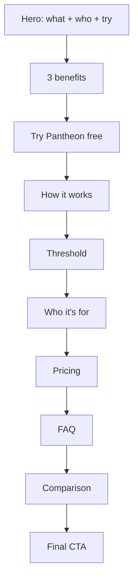

# ChronoWalk Landing v3 — Proposal for Approval

**Status:** Built on `figma` branch — awaiting review before commit  
**Date:** 10 July 2026  
**Scope:** Landing page only (`src/landing/`, v2 CSS, `landingData.js`)  
**Goal:** A cold visitor understands **what ChronoWalk is**, **what it does**, and **who it’s for** within the first screen — without insider vocabulary or a full scroll.

---

## 1. Executive summary

The current v2 landing is visually strong but optimized for people who already know the product. The headline is poetic (*Rome, as it once was*), the nav leads to **The Threshold** before explaining the app, and the strongest clarity tool (free Pantheon preview) is a secondary CTA.

**v3 keeps:** premium visual tone, tier maps, pricing stats, Threshold as differentiator, comparison table (demoted), existing checkout/preview flows.

**v3 changes:** information order, hero copy/layout, primary CTA hierarchy, new compact “what you get” strip, dedicated try-free section, simplified personas, FAQ mounted on page, nav aligned to user mental model.

---

## 2. Design principles (from agreed analysis)

| Principle | Application |
|-----------|-------------|
| **Headline = value** | State category + outcome in plain language |
| **Subhead = how** | One breath: download → walk → stories start on arrival |
| **Experience before commitment** | Try Pantheon free is primary or co-primary CTA |
| **Feature after context** | Threshold moves after “how it works” |
| **Relevance over density** | Fewer persona cards; comparison below FAQ |
| **Show the product** | Phone mockup visible in hero (not only Rome photo) |
| **No schedule framing** | One day or seven mornings — traveler’s choice |

---

## 3. Section order — before vs after

### Current (v2)

```
Header
Hero (mood-first, 100svh)
Threshold
How it feels (3 phones)
Personas (4 cards)
Comparison table
Pricing (3 tiers)
Footer
```

### Proposed (v3)

```
Header
① Hero (clarity-first, split layout + phone)
② What you get (3 benefit cards — new)
③ Try free (Pantheon preview — new section, promoted)
④ How it works (3 steps — simplified from experience)
⑤ Threshold (differentiator — moved down)
⑥ Who it's for (3 use cases — simplified personas)
⑦ Pricing (3 tiers — copy tweaks only)
⑧ FAQ (wired in — new on page)
⑨ Comparison (demoted — same component)
⑩ Final CTA (new — closing band)
Footer
```



---

## 4. Above-the-fold spec (hero)

### Layout

| Zone | Desktop | Mobile |
|------|---------|--------|
| Left / top | Copy block | Copy block |
| Right / middle | Phone frame showing map or listening screen | Phone overlaps lower third of Rome photo |
| Background | Rome hero photo + scrim (keep current asset) | Same, reduce `min-height` from `100svh` → `min(100svh, 52rem)` so benefits peek on scroll |

**Hero no longer uses full viewport only for wallpaper.** Content and product visible together.

### Copy (proposed)

| Element | Copy |
|---------|------|
| **Eyebrow** | Audio walking app · Rome · Works offline |
| **Headline** | Walk Rome with stories that start at each landmark. |
| **Subheadline** | Download the route to your phone. Walk at your pace — no group, no schedule. When you reach the Colosseum, Forum, or Pantheon, the narration begins. At key ruins, press and hold to see how they looked 2,000 years ago. |
| **Primary CTA** | Try the Pantheon free |
| **Secondary CTA** | See Rome routes from €9 → `#pricing` |
| **CTA microcopy** | Free preview · ~4 minutes · No account |

### Hero stats (replace cryptic Free / Your pace / 1×)

| Value | Label |
|-------|-------|
| 22 stops | Colosseum to Appian Way |
| Offline | Download once, walk without signal |
| One-time | No subscription |

### Optional accent line (display font, below headline)

*Rome, as it once was.* — kept as **secondary poetic line**, not the H1. Approves warmth without sacrificing clarity.

---

## 5. Full copy deck — all sections

### ② What you get (new)

**Eyebrow:** What you get  
**Headline:** A walking guide in your pocket — not a group tour.

| Card | Title | Body |
|------|-------|------|
| 1 | Stories where you stand | Narration starts when you reach each stop. Keep your eyes on Rome, not your screen. |
| 2 | See ancient Rome | Press and hold at selected ruins to compare today’s view with a researched reconstruction. |
| 3 | Your trip, your pace | One day, three mornings, or a full week between stops. Pause anytime — the route waits. |

---

### ③ Try free (new section)

**Eyebrow:** Try before you buy  
**Headline:** Hear it at the Pantheon — free.  
**Lead:** Stand outside the Pantheon (or try it from home) and hear how ChronoWalk works: GPS-triggered narration, studio-written story, and the same stop included in every Rome package.  
**Card title:** The Pantheon Sneak Peek  
**Card meta:** Free preview · ~4 minutes  
**Primary CTA:** Play free preview → `/preview`  
**Secondary CTA:** Skip to pricing → `#pricing`  
**Trust line:** No account required for the preview.

*Reuses existing `FREE_PREVIEW` + `LANDING_PREVIEW_AUDIO_FILE` + `handlePreview` flow.*

---

### ④ How it works (replaces “How it feels” as primary explainer)

**Eyebrow:** How it works  
**Headline:** Download. Walk. Listen.  
**Lead:** Three steps — no planning spiral, no tour group.

| Step | Title | Body | Screen asset |
|------|-------|------|--------------|
| 1 | Download the route | At your hotel or before you fly. Map, stories, and reconstructions — ready offline. | `screen-map.png` |
| 2 | Walk to each landmark | A simple map guides you between stops. GPS knows when you’ve arrived. | `screen-map.png` or walking UI |
| 3 | Arrive and listen | The story opens where it happened. Prefer reading? Use the transcript. | `screen-listening.png` |

**Removed from lead:** negative competitor framing (*Not a trivia game…*) — moved to comparison section only.

---

### ⑤ Threshold (existing section, repositioned)

**Eyebrow:** What makes it different  
**Headline:** Press and hold. The ruin becomes the room.  
**Lead:** At selected landmarks, compare today’s stones with an evidence-based reconstruction matched to the view in front of you — not a stock illustration.  
**Bullets:** (unchanged)  
- Matched to the vantage point in front of you  
- Audio opens when you reach each stop — built for heads-up walking  
- Reconstructions are researched; gaps are acknowledged in the copy  
**Hold label:** Hold to reveal  
**Visual:** existing `threshold.png`

*Nav no longer links here directly. Section id stays `#threshold` for deep links.*

---

### ⑥ Who it's for (simplified personas)

**Eyebrow:** Who it's for  
**Headline:** Built for anyone walking Rome without a guide.  
**Lead:** You don’t need a history degree or a perfect itinerary.

| Tag | Title | Body |
|-----|-------|------|
| First trip to Rome | Close the tabs. Open one route. | Overwhelmed by pins and blog posts? Download one curated walk and trust the day is worth taking. |
| Curious, not academic | Ruins that finally make sense. | You’ve seen the names — now hear the scenes, tied to the stones in front of you. |
| On your own terms | No flag. No crowd of thirty. | Share headphones, pause for coffee, pick it up tomorrow or next week. No schedule attached. |

**Cut from v2:** separate “Without a ticket” card — folded into First trip copy as one sentence: *Much of Rome’s greatest history is visible from open squares and façades.*

**Visual:** keep `lifestyle-couple.png` beside intro column.

---

### ⑦ Pricing (existing component, copy tweaks)

**Headline:** Pick how much of Rome you want.  
**Subheadline:** Self-guided audio walking tours. One-time purchase — download the route and it’s yours for the trip and after.  
**Intro line (new, above grid):** All packages include GPS-triggered narration, offline download, and the Pantheon preview stop.

**Tier naming display (UI tweak):** show **Central / Ancient / Complete** as primary label; Roma Historica / Antica / Eterna as eyebrow (invert current hierarchy for cold users).

**Tier descriptions — minor edits:**

| Tier | Description (proposed) |
|------|------------------------|
| Central €9 | The Pantheon and centro storico — Trevi, Navona, Campo, Argentina, and Castel Sant'Angelo. Outside the Colosseum archaeological park. |
| Ancient €12 | The ancient core — Colosseum and Roman Forum — with full narration and Threshold reconstructions at each stop. |
| Complete €17 | The full Rome walk — archaeological core, centro storico, outer loop, and your own stop order. |

**Stats row, maps, monument lists:** unchanged (audio / tour time / route distance).

**Footnote:** unchanged.

---

### ⑧ FAQ (wire existing content + 1 new item)

**Headline:** Questions before you walk

| Question | Answer |
|----------|--------|
| **What is ChronoWalk?** *(new)* | A self-guided walking app for Rome. You follow a route on your phone; stories play when you arrive at each landmark. No tour group, no fixed schedule. |
| Is this a group tour? | No. ChronoWalk is self-guided. Start when you want, pause when you want, and walk at your own pace. |
| Does it work offline? | Yes. Download the route and stories before you walk. GPS works best outdoors in open streets and squares. |
| Do I need tickets for every stop? | ChronoWalk complements Rome’s open streets, ruins, piazzas, and viewpoints. It does not replace ticketed entry where tickets are required — but most of the experience happens in places you can reach on foot. |
| How long does it take? | However long you like. Some travelers finish in a single day; others spread it across mornings and come back when they feel like it. There is no schedule — pause and resume whenever you like. |

**Component:** new `LandingFaqSection.v2.jsx` styled to match v2 tokens (or restyle existing FAQ).

---

### ⑨ Comparison (demoted, copy unchanged)

Stays as competitive differentiation for users who already understand the category. Moves below FAQ so it doesn’t interrupt the purchase path.

**Optional mobile tweak:** collapse to accordion or show ChronoWalk column only with “vs typical audio tour apps” summary — *defer unless you want it in v3.0*.

---

### ⑩ Final CTA (new closing band)

**Headline:** Ready to walk Rome?  
**Primary CTA:** Try the Pantheon free  
**Secondary CTA:** See routes from €9  
**Footer line:** ChronoWalk · Rome · Self-guided walking journeys

---

## 6. Header & footer

### Header nav

| Current | Proposed |
|---------|----------|
| The Threshold | How it works → `#how-it-works` |
| How it works | Try free → `#try-free` |
| Why ChronoWalk | Pricing → `#pricing` |
| Pricing | *(removed from nav — redundant with CTA)* |

**Header CTA button:** Try free → `#try-free` (was: Begin your journey → pricing)

### Footer

**Tagline (proposed):** Self-guided audio walking tours for Rome — researched, studio-written, and yours to keep.

**Nav:** How it works · Try free · Pricing · FAQ

---

## 7. CTA hierarchy (site-wide)

| Location | Primary | Secondary |
|----------|---------|-----------|
| Header | Try free | — |
| Hero | Try the Pantheon free | See routes from €9 |
| Try free section | Play free preview | See pricing |
| Pricing cards | Begin Journey *(per tier)* | — |
| Final CTA | Try the Pantheon free | See routes from €9 |

**Retired phrase as primary CTA:** *Begin your journey* — may remain on tier buttons only (purchase intent is clear in context).

---

## 8. Visual & CSS changes

| Item | Change |
|------|--------|
| Hero | Split grid: copy + `LandingPhoneFrame` with `screen-listening.png` |
| Hero height | `min-height: min(100svh, 52rem)` on mobile; `auto` with padding on desktop |
| What you get | New `.cw-v2-benefits` — 3-column grid, icon or small illustration per card |
| Try free | New `.cw-v2-try-free` — bone/raised card, Pantheon thumb, coral CTA |
| How it works | Reuse experience grid pattern but 3 steps with numbered labels |
| FAQ | v2-styled accordion, bone section for contrast before footer |
| Final CTA | Compact centered band, coral button |
| Tier cards | Swap visual hierarchy: tierLabel prominent, eyebrow secondary |

**No new photography required** — reuses `LANDING_V2` assets.

---

## 9. Files to create / modify

### New components

| File | Purpose |
|------|---------|
| `LandingBenefitsSection.jsx` | 3-card “what you get” strip |
| `LandingTryFreeSection.jsx` | Promoted Pantheon preview block |
| `LandingWhoItsForSection.jsx` | 3 use cases (or refactor `LandingPersonasSection`) |
| `LandingFaqSection.v2.jsx` | FAQ in v2 design tokens |
| `LandingFinalCtaSection.v2.jsx` | Closing CTA band |

### Modified

| File | Changes |
|------|---------|
| `landingData.js` | New content keys: `benefits`, `tryFree`, `whoItsFor`; rewrite `hero`, `header`, `footer`, `pricing`, `faq`; update `how-it-works` steps; `LANDING_SECTION_ORDER` |
| `LandingHero.jsx` | Split layout, phone frame, new stats, CTA order |
| `ChronoWalkLanding.jsx` | New section order, mount FAQ + final CTA |
| `LandingExperienceSection.jsx` | Repurpose as how-it-works OR replace with new component |
| `LandingRomeTiersSection.jsx` | Tier label hierarchy, pricing intro line |
| `ChronoWalkLanding.v2.css` | Hero grid, benefits, try-free, FAQ v2, final CTA |
| `scripts/check-design.mjs` | Update if new forbidden words introduced |

### Unchanged (behavior)

| File | Reason |
|------|--------|
| `landingCheckout.js` | Checkout logic unchanged |
| `LandingTierRouteMap.jsx` | Maps stay |
| `landingTierStats.js` | Stats stay |
| `useLandingPrice.js` | Price resolution unchanged |
| Preview flow / `handlePreview` | Same route |

### Deprecated on page (not deleted)

- `LandingPersonasSection.jsx` — replaced by who-it’s-for
- `LandingExperienceSection.jsx` — absorbed into how-it-works

---

## 10. Content keys structure (`landingData.js`)

```js
export const LANDING_SECTION_ORDER = [
  'hero',
  'benefits',
  'try-free',
  'how-it-works',
  'threshold',
  'who-its-for',
  'pricing',
  'faq',
  'comparison',
  'final-cta',
]

export const LANDING_CONTENT = {
  hero: { /* §4 */ },
  benefits: { /* §5② */ },
  tryFree: { /* §5③ */ },
  'how-it-works': { /* §5④ — 3 steps */ },
  threshold: { /* §5⑤ — mostly unchanged */ },
  whoItsFor: { /* §5⑥ */ },
  pricing: { /* §5⑦ */ },
  faq: { /* §5⑧ */ },
  comparison: { /* unchanged */ },
  'final-cta': { /* §5⑩ */ },
  header: { /* §6 */ },
  footer: { /* §6 */ },
  // legacy keys retained for archive components
}
```

---

## 11. Out of scope (v3)

- New photography or video shoot
- Interactive Threshold demo in hero (future v3.1)
- Testimonials / social proof (no review data yet — credibility line stays in FAQ)
- Multi-city landing
- Checkout or product ID changes
- Host banner / sticky CTA (can add in v3.1 if wanted)

---

## 12. Implementation phases

| Phase | Work | Est. effort |
|-------|------|-------------|
| **A** | `landingData.js` copy + section order | 1–2 h |
| **B** | Hero split layout + benefits strip | 2–3 h |
| **C** | Try free + how-it-works sections | 2 h |
| **D** | Reorder page, who-it’s-for, FAQ v2, final CTA | 2–3 h |
| **E** | Pricing label hierarchy + CSS polish | 1–2 h |
| **F** | `check:design`, tests, responsive QA | 1–2 h |

**Total:** ~1–2 days focused work.

---

## 13. Success criteria (how we know v3 worked)

A first-time visitor can answer within **10 seconds**:

1. ✅ It’s a phone app for walking Rome  
2. ✅ Stories play when you arrive at landmarks  
3. ✅ I can try the Pantheon free before paying  
4. ✅ No group tour, no subscription, works offline  
5. ✅ I pick a package based on how much of Rome I want  

---

## 14. Decisions for your approval

Please mark each item **Approve**, **Reject**, or **Change** (with note):

| # | Decision | Default proposal |
|---|----------|------------------|
| 1 | **Hero headline** | *Walk Rome with stories that start at each landmark.* |
| 2 | **Keep poetic line** | *Rome, as it once was.* as secondary accent under H1 |
| 3 | **Primary CTA site-wide** | Try free (not Begin journey) |
| 4 | **Hero phone mockup** | Yes — listening screen in split layout |
| 5 | **Section order** | As §3 (comparison below FAQ) |
| 6 | **Personas → 3 use cases** | Cut standalone “without a ticket” card |
| 7 | **Tier label hierarchy** | Central/Ancient/Complete prominent over Latin names |
| 8 | **New FAQ item** | “What is ChronoWalk?” at top |
| 9 | **Header CTA** | Try free (links to `#try-free`) |
| 10 | **Hero height** | Reduce from full viewport on mobile |

---

## 15. Approval

| Role | Name | Status | Date |
|------|------|--------|------|
| Product / copy | | ☐ Approved ☐ Changes requested | |
| Design | | ☐ Approved ☐ Changes requested | |
| Engineering | | ☐ Approved to implement | |

**Once approved:** implementation proceeds on branch `figma` (or new `landing-v3`), no commit until you review the built page.

---

*End of proposal*
